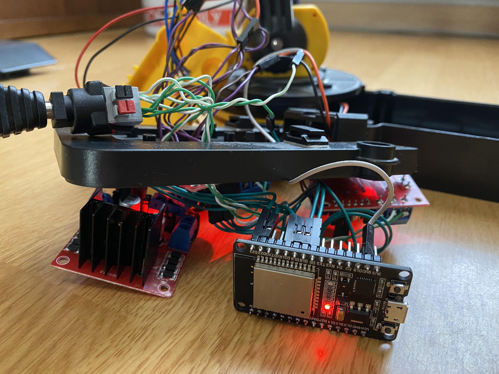
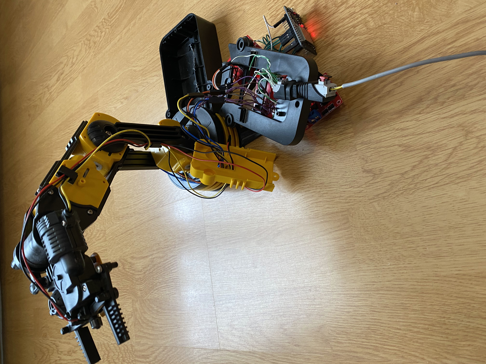

# Controlling a Robotic Arm with .NET nanoFramework on ESP32 with REST API

This repository includes a sample for controlling a toy robotic arm with an ESP32 using [.NET nanoFramework](https://github.com/nanoframework/home) and [nanoFramework.WebServer](https://github.com/nanoframework/lib-nanoFramework.WebServer)

